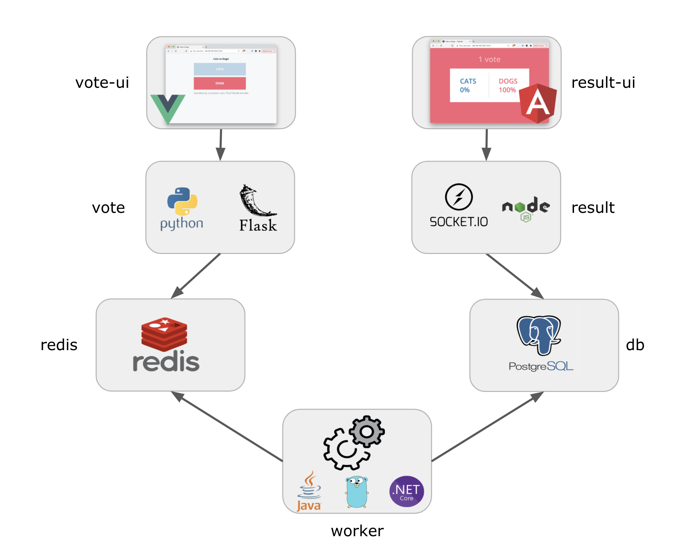
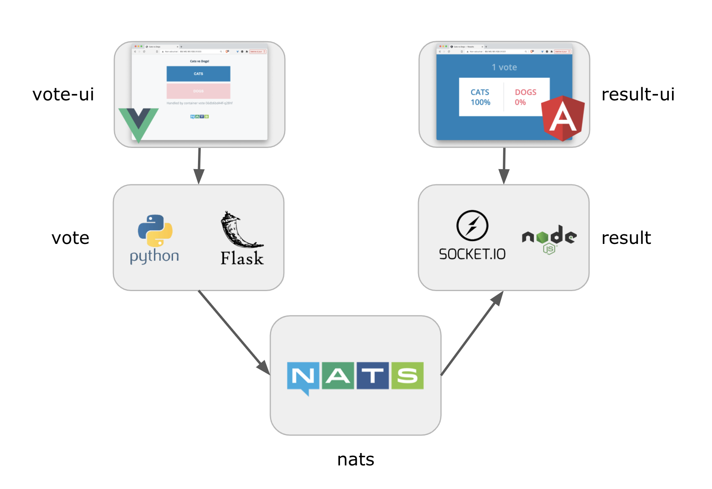

This project is a clone of the official [Docker Example Voting App](https://github.com/dockersamples/example-voting-app) used for tests and demo purposes only.

This repository is used to illustrate how the different versions of the VotingApp can be deployed:
- on different environments
- using different tools

First of all let's talk a little bit about this simple thus very interesting demo application.

# What is the VotingApp

The VotingApp is a *demo* application following a micro-services architecture. 

It does not follow all good architectural best practices but it is a good example of an application using several languages, several databases and definitely a great one to learn Docker and Kubernetes related concepts (and much more)

There are currently 3 different versions of this application:
- v1: original version
- v2: new frontends for result and vote
- v3: same as v2 but using NATS instead of Redis+Postgres+Worker

## v1: original version (legacy)

This is the first version of the VotingApp. It is composed of 5 micro-services as illustrated in the following schema.


- vote: front end in Python / Flask that enables a user to choose between a cat and a dog
- redis: database where votes are stored
- worker: service that get votes from Redis and store the results in a Postgres database (a Java ,.NET and Go version exist for that service)
- db: the Postgres database in which vote results are stored
- result: front end, displaying the results of the vote

Note: this version might be removed in the future

## v2: new frontends

In this version, 2 additional services were added: *vote-ui* and *result-ui*, the communicate respectively with enhanced versions of *vote* and *result*

The VotingApp v2 is thus composed of 7 microservices as illustrated in the following schema:



- vote-ui: front end in VueJS that enables a user to choose between a cat and a dog
- vote: backend exposing an API with Python / Flask 
- redis: database where votes are stored
- worker: service that get votes from Redis and store the results in a Postgres database (a Java ,.NET and Go version exist for that service)
- db: the Postgres database in which vote results are stored
- result: backend sending scores to a UI through websocket
- result-ui: front end in Angular displaying the results of the votes

## v3: NATS backend

This version does not use Redis, Postgres and the worker services anymore. NATS is used as a Pub/Sub mecanism instead for the *vote* and *result* microservice to communicate.

The VotingApp v3 is thus composed of 5 microservices as illustrated in the following schema.



- vote-ui: front end in VueJS that enables a user to choose between a cat and a dog
- vote: backend exposing an API with Python / Flask 
- nats: message broker acting as a Pub/Sub between vote and result
- result: backend sending scores to a UI through websocket
- result-ui: front end in Angular displaying the results of the votes


# Get it locally

Use the following commands to clone all the projects in a local folder

```
mkdir VotingApp && cd VotingApp
for project in config vote vote-ui result result-ui worker; do
  git clone https://gitlab.com/voting-application/$project
done
```

# The projects repositories

In the official GitHub repository, all the projects are under the same umbrella. To clarify the things and make it easier to map it against a real micro-service application, we've splitted the application so that each micro-service has it's own Git repository.

- vote (v1, v2 and v3 branches)
- vote-ui
- result (v1, v2 and v3 branches)
- result-ui
- worker

# The configuration repository

The *config* repository is a new repository that has been added, it is used to deploy the whole application in several ways in a Kubernetes or Docker (Compose / Swarm) environments:

## Deployment on a simple machine with Docker Compose

Prerequisites: clone all repositories (config, vote, result, worker) in the same folder.

From *config/compose*, run the following command:

```
$ docker-compose up
```

This deploys the application using the branches currently checked out for each microservice.

The *LANGUAGE* environment variable can to be set to *java*, *dotnet* or *go* to deploy the corresponding flavor of the worker microservice. The following command deploy the VotingApp with the *java* version of the worker.

```
LANGUAGE=java docker-compose up
```

## Installation with standard manifests

The *manifests* folder contains subfolders, each of them containing the yaml specifications of the application:

To install the version *VERSION* of the VotingApp, run the following command (changing the VERSION to either v1, v2 or v3)

```
kubectl apply -f manifests/VERSION
```

## Installation with [Helm](https://helm.sh)

The application can be installed using [Helm](https://helm.sh) with the following command within the *helm* folder:

```
helm upgrade --install -f values.yaml voting .
```

*values.yaml* contains properties that enable to configure the version that should be deployed (v1, v2 or v3) and the language of the worker (Java, .NET or Go)

## Installation with [Kustomize](https://kustomize.io)

The different flavors of the application can be installed using [Kustomize](https://kustomize.io). From the *kustomize* folder, each version can be deployed using the following command:

```
kubectl apply -k overlays/VERSION
```

# Blog articles

Several articles using the VotingApp to illustrate technological pieces:
- [Raw Manifests, Helm, Kustomize Several ways an application can be deployed in Kubernetes](https://itnext.io/k8s-tips-manifests-helm-kustomize-12f72f878022)
- [Deploying the VotingApp on Shipa](https://itnext.io/deploying-the-votingapp-on-shipa-2af9c6097bb3)
- [Docker, Kaniko, Buildah, different ways to build container images](https://itnext.io/docker-kaniko-buildah-209abdde5f94)
